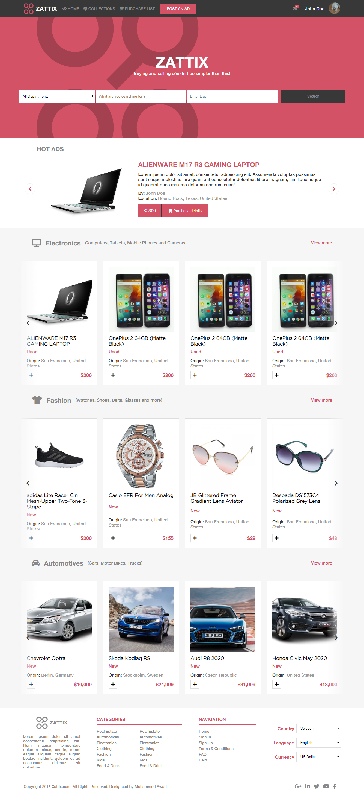
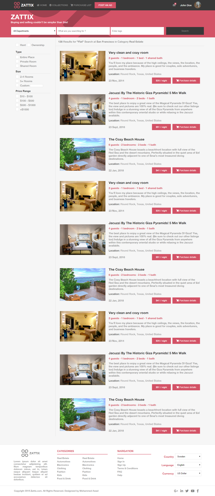

# Microverse capstone project

## Description

This is a design implementation of [ZATTIX](https://www.behance.net/gallery/24796463/ZATTIX). which is an online shop. The website consists of 2 pages, a home page, and a search page. The homepage contains a search form that is used to go to the search page and apply some filtration. and carousels for different product categories.
The project has been implemented with HTML, Stylus, and Javascript. and it supports multiple screen sizes.

## Screenshots
Home page
 

 

Search page
 

## Built With

- HTML, CSS, Stylus, Javascript

## Live Demo

[Live Demo Link](https://wintercore.github.io/microverse-html-capstone-project/)

## Getting Started

To get a local copy up and running follow these simple example steps.

### Usage
This project uses stylus instead of css for styling. However, it already contains the compiled css code so you don't have to set up anything by yourself.
Just open the `index.html` page.

## Commands
- `validate-html` Validate the structure of the HTML
- `lintjs` Checks the javascript for any lint errors
- `build:css` Compile the stylus code into css
- `build:css:watch` Compile the stylus code into css and watch for changes

Note: You need to do `npm install` before executing the commands above.

## Authors

👤 **WinterCore**

- Github: [@WinterCore](https://github.com/WinterCore)

## 🤝 Contributing

Contributions, issues and feature requests are welcome!

Feel free to check the [issues page](issues/).

## Show your support

Give a ⭐️ if you like this project!

## Acknowledgments

- Hat tip to anyone whose code was used
- Inspiration: The [design](https://www.behance.net/gallery/24796463/ZATTIX) was taken from [Mohammed Awad's](https://www.behance.net/M_Awad) behance. Make sure to check him out.
- etc

## 📝 License

This project is [MIT](lic.url) licensed.